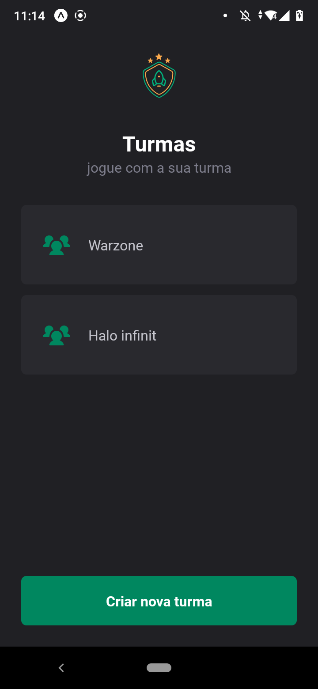
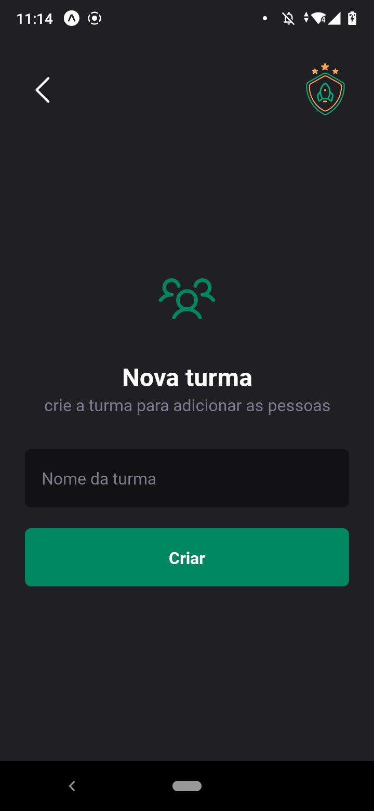
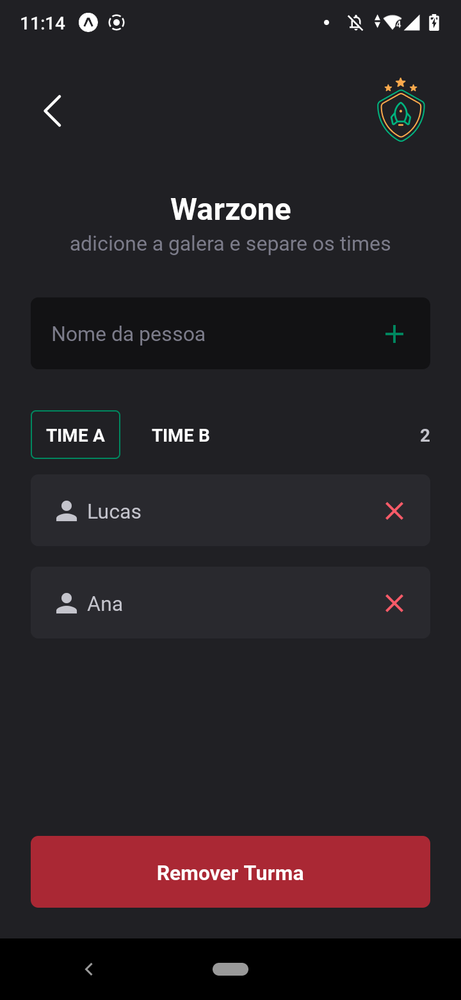

# App - Teams

Aplicação mobile em React Native usando navegação stack e local storage. O aplicativo permite criar turmas de jogos e atividades e dividir pessoas entre as duas turmas

## Telas:

    
    
    
    

## Funcionalidades
As funcionalidades possíveis na aplicação, que são:

* Criar turmas
* Apagar Turmas
* Visualizar todas as turmas
* Colocar componentes nas turmas e dividir em equipes
* Apagar integrantes das equipes
* Salvar localmente no dispositivo as informações

    

    
 &nbsp;
 &nbsp;
 

  
